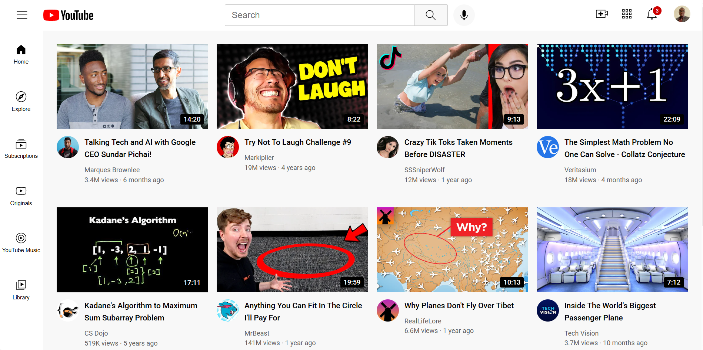

# YouTube Homepage Clone

A static replication of the YouTube homepage built from scratch using semantic HTML and modern CSS (Flexbox and Grid).

## 🚀 Project Overview
This project was built as a deep-dive into front-end fundamentals. The goal was to replicate a complex, real-world UI without using any JavaScript or external CSS frameworks (like Bootstrap).

## 🛠️ Technologies Used
- **HTML5**: Used semantic tags (`<header>`, `<nav>`, `<main>`) for better accessibility and SEO.
- **CSS3**: 
  - **CSS Grid**: Used for the main video layout and the video info sections.
  - **Flexbox**: Used for the header navigation and sidebar alignment.
  - **Positioning**: Implemented `fixed` headers/sidebars and `absolute` positioning for video time badges.
  - **Responsive Design**: Used `auto-fit` and `minmax` to ensure the grid adapts to different screen sizes.

## ✨ Key Features
- **Fixed Header & Sidebar**: Navigation stays in place while scrolling.
- **Hover Effects**: Custom tooltips for header icons and background changes for sidebar links.
- **Search Bar Focus**: Custom blue border styling when the search bar is active.
- **Notification Badges**: Absolute-positioned badges on the notification icon.

## 📸 Screenshots

## 🧠 What I Learned
- How to organize CSS into multiple files (`base`, `layout`, `components`) for better maintainability.
- The importance of the `box-sizing` property and `viewport` meta tags for layout consistency.
- How to debug layout shifts using temporary borders.
